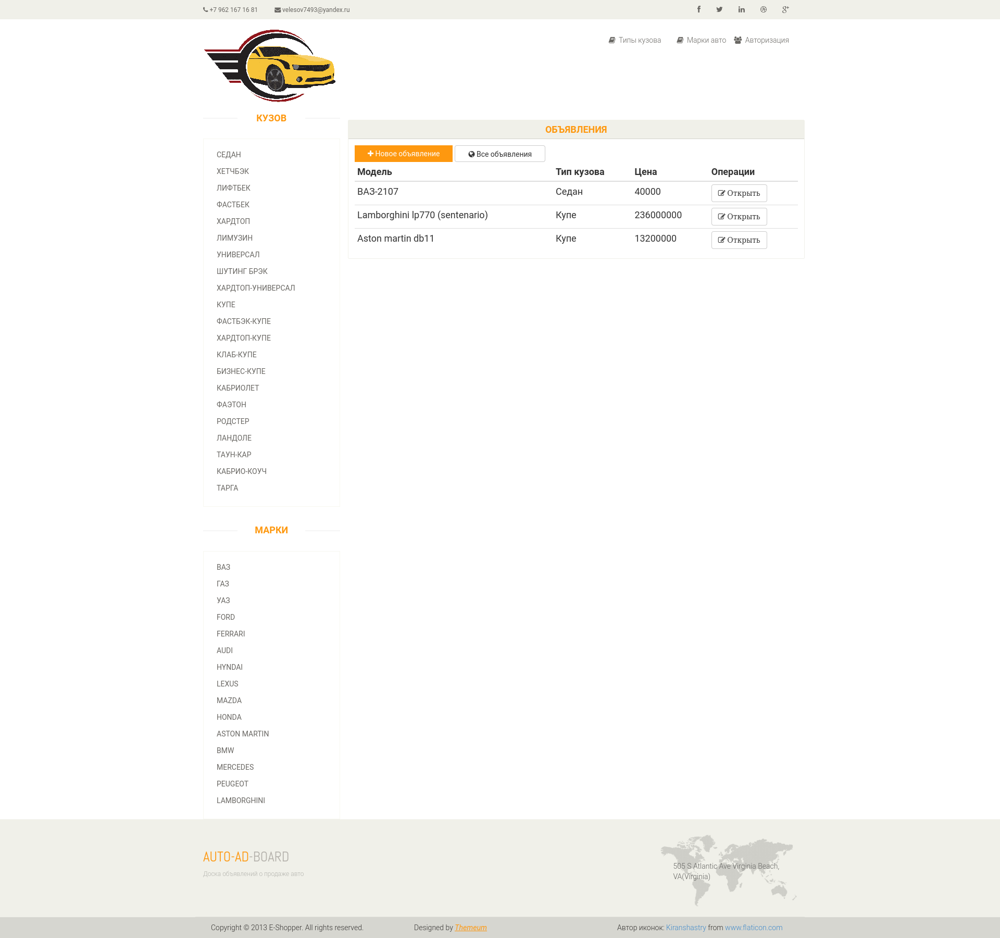
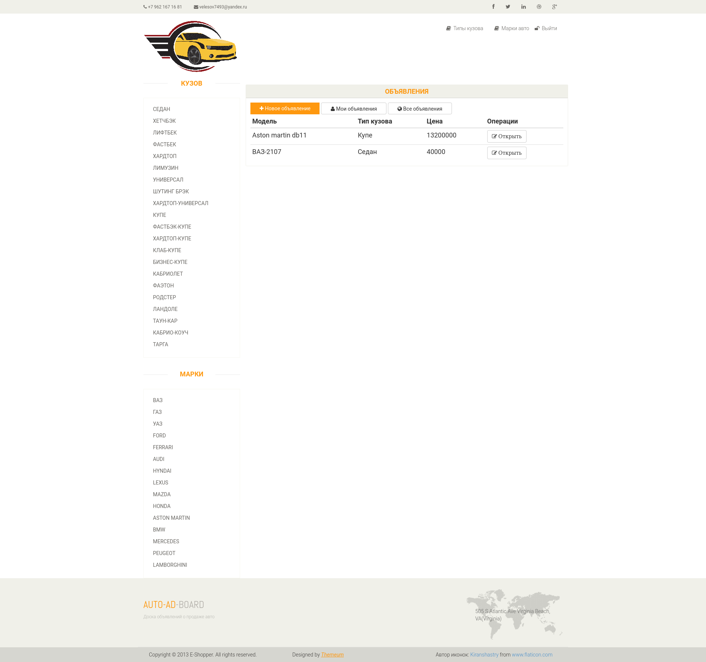
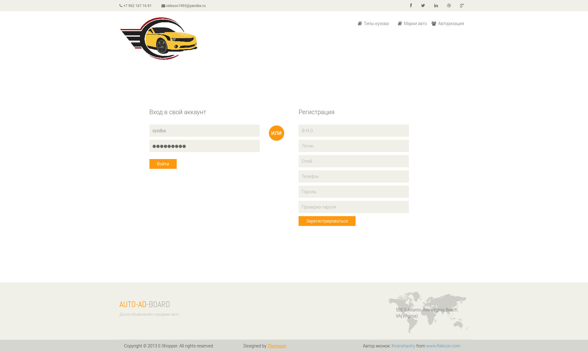
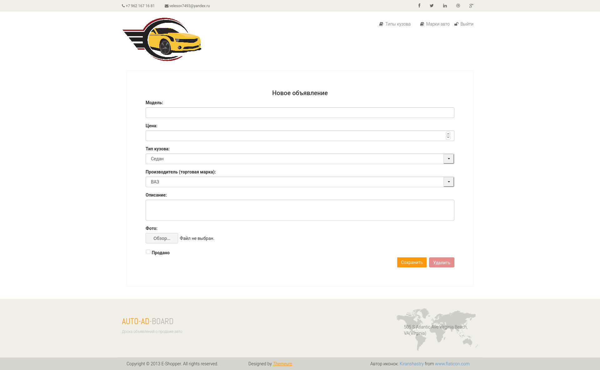
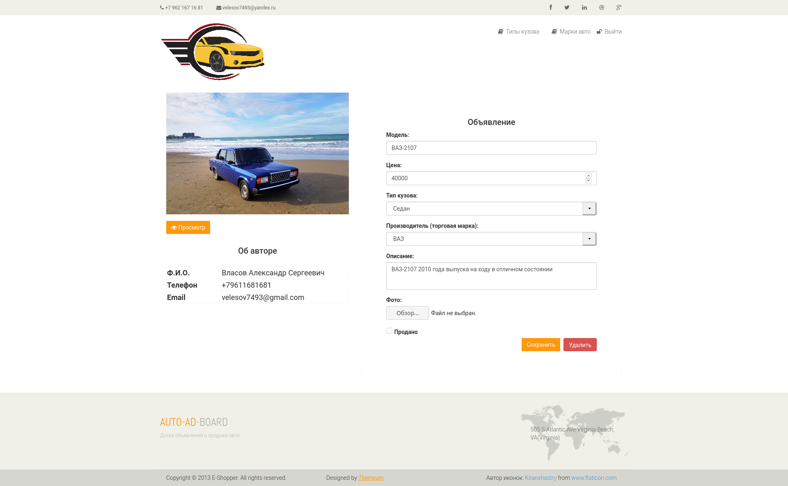
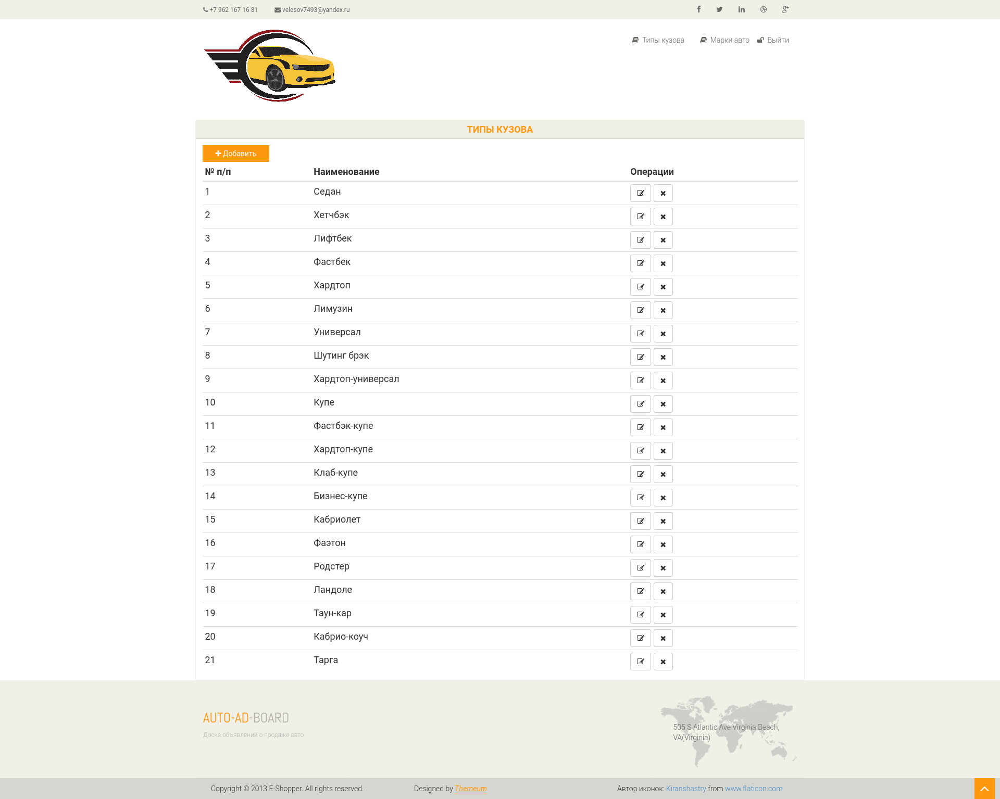
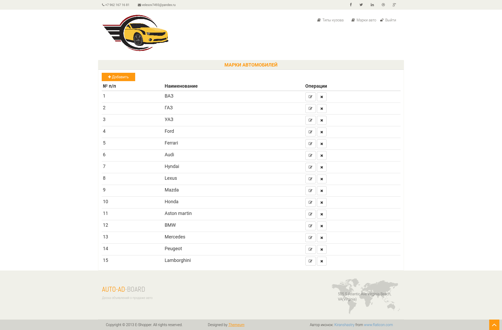
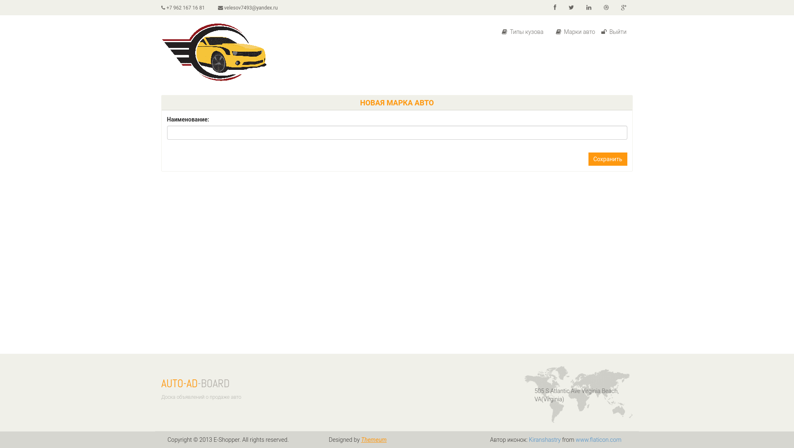

## Описание ##
Это учебный проект веб-сайта для размещения объявлений по продаже автомобилей.
Любой зарегистрированный пользователь может выполнять все операции (создание, чтение, изменение, удаление) со своими объявлениями.
Чужие объявления можно только просматривать. Для неавторизованных пользователей все объявления чужие.
#### Технологии проекта ####

## Скриншоты ##
#### Главная страница (список активных объявлений, т.е. еще не проданных авто) ####

#### Главная страница при выполненной авторизации ####

#### Авторизация и регистрация ####

#### Создание объявления о продаже ####

#### Редактирование объявления о продаже ####

#### Типы кузова ####

#### Марки авто ####

#### Создание марки авто ####

Форма создания типа кузова выглядит аналогично, отличаясь только заголовком и действием.
При редактировании марки авто и типа кузова используются те же формы, что и при создании.